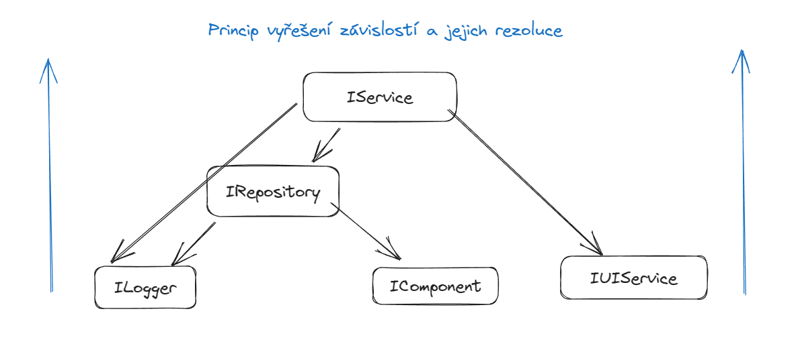

# Dependency injection (vstříkávání závislostí, vkládání)

> Řešení složitých závislostí ve velký aplikacích a jejich snadná modifikace.

Cílem DI je vytvářet slabé vazby mezi komponenty v aplikacích. Místo používání konkrétních implementací, používáme abstrakce (_rozhraní_), jejichž implementace vkládáme nejprve do DI kontejneru a z toho putují přímo na místo určení.

Místa určení (_způsoby implementace_) bývají dva druhy:

- Vkládání závislostí do konstruktorů
- Vkládání závislostí do vlastností jednotlivých tříd

### Do konstruktoru

```csharp
class Foo
{
    public Foo(ILogger logger, IRepository repository, IService service)
    {
        _logger = logger;
        _repository = repository;
        _service = service;
    }

    // Použití těch závislostí
}
```

### Do vlastností

```csharp
class Foo
{
    [Dependency]
    public ILogger Logger {get; set;}

    [Dependency]
    public IRepository Repository {get; set;}

    [Dependency]
    public IService Service {get; set;}

    // Použití těch závislostí
}
```

## Pracovní postup

Nejprve vložíme všechny závislosti do kontejneru a pak tzn. sestavíme - necháme DI kontejner vyřešit všechny závislosti. Když by nám nějaká závislost chyběla, kontejner nám to oznámí při startu aplikace.



Závislosti konzumujeme nepřímo skrze konstruktory, nebo vlastnosti.

## Motivace pro použití DI

1. Jednoduchá správa závislostí napříč projektem (_můžeme snadno vyměnit závislosti v naší aplikace_).
2. Správa životnosti objektů.
3. Zpřehlednění závislostí napříč projektem.

## DI v .NETu

V .NET Core a .NETu obecně již máme DI nativně přímo od Microsoftu s pomocí NuGet balíčků. ASP.NET Core toto již obsahuje v rámci Web projektu. Odkaz na podrobnosti [zde](https://learn.microsoft.com/en-us/dotnet/core/extensions/dependency-injection).

NuGet pro DI - `Microsoft.Extensions.DependencyInjection`.