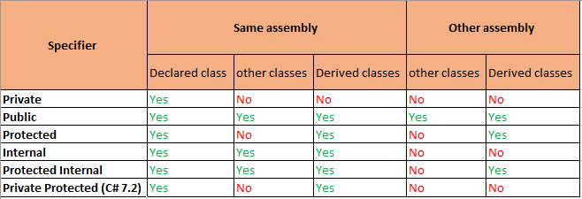

# [Fasáda](https://en.wikipedia.org/wiki/Facade_pattern)

> Jednoduché rozhraní pro složité systémy.

Fasáda je návrhový vzor, který zjednodušuje přístup ke složitým a/nebo komplexním systémům. Cílem je zjednodušit rozhraní komplexního systému (_nebo ho zcela překrýt_) jednodušším rozhraním - **fasádou**.

## Kdy se fasáda používá?

* Máme komplexní, monolitický systém, obtížný na použití. Fasáda může zjednodušit implementaci klientů.
* Úzce spjatý nebo přímo závislý kód mezi uživatelskými třídami a implementačními třídami.
* Porušení [Déméteřina zákona](https://cs.wikipedia.org/wiki/D%C3%A9m%C3%A9te%C5%99in_z%C3%A1kon)
* Separace aplikačních vrstev pro u aplikací uspořádaných do vrstev. Fasáda pro každou vrstvu.
* Defenzíva pro proti komplikovaným klientům, chybějící implementaci, bezpečnostním rizikům, závislosti na implementačních detailech.

## Implementace na úrovni jazyka

Modifikátory přístup u tříd a method mohou sloužit jako implementační prostředek fasády, např. u knihoven. Není náhoda, že výchozí viditelnost je `internal`.



## Implementace na úrovni architektury

Potřeba testů nás většinou donutí jít cestou abstrakce (_než cestou jedné implementace_).

Opět máme dvě možnosti - abstraktní třídy s primárně abstraktními metodami a rozhraní. Primárně volíme rozhraní, protože fasáda většinou nevede na potřebu sdílení implementací skrze abstraktní třídu.

U rozhraní si musíme dát pozor na porušení [Déméteřina zákona](https://cs.wikipedia.org/wiki/D%C3%A9m%C3%A9te%C5%99in_z%C3%A1kon), což v praxi znamená používat striktně přístupové metody, nikoliv metody z vlastností.

### Příklad porušení Déméteřina zákona

```csharp
interface IFoo
{
    public void DoSomething();
}

interface IBar
{
    public IFoo Foo {get;}
}

class Bar : IBar
{
    public IFoo Foo {get; init;}
}

// ❌ Porušení zákona
new Bar().Foo.DoSomething();

```

### Bez porušení zákona Déméter

```csharp
interface IFoo
{
    public void DoSomething();
}

interface IFacade
{
    public void DoSomething();
}

class Bar : IFacade
{
    private readonly IFoo _foo;

    public Bar(IFoo foo) => _foo = foo;

    public void DoSomething() => _foo.DoSomething();
}

// ✅
new Bar().DoSomething();

```

**V rozhraní fasády nikdy nevystavujeme vlastnosti.**

## Příklady fasády z .NET

* [Task.Run() je fasáda pro TaskFactory.StartNew()](https://devblogs.microsoft.com/pfxteam/task-run-vs-task-factory-startnew/)