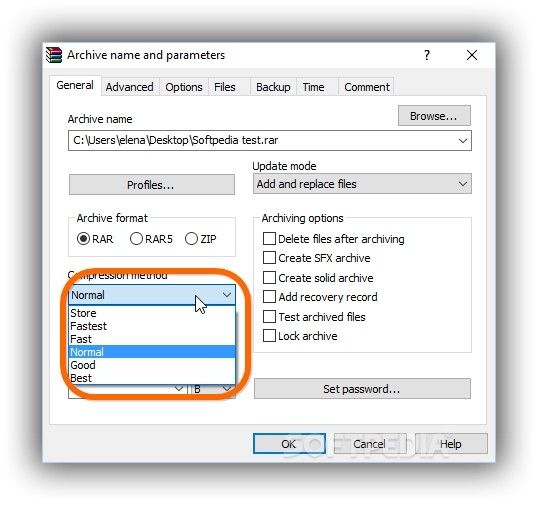

# Strategie

> Implementace různých přístupů (_strategií_), které jsou z pohledu klienta vzájemně zaměnitelné.

Vynucení chování třídy na základě **vnějšího** stavu, příkazu. Chování určuje klient (_je vnuceno z venku_).

Vzor Strategie zapouzdřuje určité chování tak, aby si klient mohl vybrat jakoukoliv variantu a neovlivnilo to výsledek. Cílem je tak vytvořit závislost chování třídy na jejím vnějším stavu, zjednodušit vnitřní implementaci (_odstranit `if`y_) a celkově zpřehlednit kód implementací jednotlivých stavových chování do samostatných tříd.

Tento vzor je podobný se stavem, kde však změna přichází zevnitř, nepřímo.

## Složení (dle GoF)

1. Vícestavová třída (_konzument strategie_)
2. Strategie

## Princip

Strategie třídy modelujeme konkrétní implementací rozhraní (_častěji_) nebo abstraktní třídy. Dědičnost nepoužíváme, protože to porušuje Open/Close princip a vedl by často na duplicitní kód. Klient si vybere konkrétní implementaci strategie, např. na základě vstupu uživatele, nastavení aplikace, systémových zdrojů a předá ji ke konzumaci. Tímto dojde ke změně chování objektu jako celku.

Konkrétní chování se tak odděluje do samostatných implementací, které tímto zapouzdřujeme samostatně.

Změna strategie nesmí ovlivnit konzumenta.

## Použití

* Třídící algoritmy
* Algoritmy numerické matematiky, např. ODR, lineární algebra
* Kompresní algoritmy

()

### Příklad hry ze světa Star Treku

Představme si příklad, že modelujeme tahovou strategii ze světa Star Treku, kde se střetávají dvě kosmické lodě. Zde využijeme strategii hned několik stavů.

1. Taktické manévrovací styly, ze kterých si hráč vybere (_počty přemístění a změny směrů_).
2. Volba typu zbraní na taktické konzole (fasery, disruptory, fotonová torpéda), útok však může loď zamítnout na základě vnitřního stavu zbraňových systémů a zásob energie a střeliva.
3. Strategie distribuce energie, např. do štítů, motorů, zbraní a systémů podpory života.

## Příklad implementace

```csharp
public interface IAttackStrategy
{
    decimal GetDamage();
    decimal GetSpeed();
}

public class DefiantClass
{
    public IAttackStrategy Strategy = new OffensiveStrategy();
}
```
